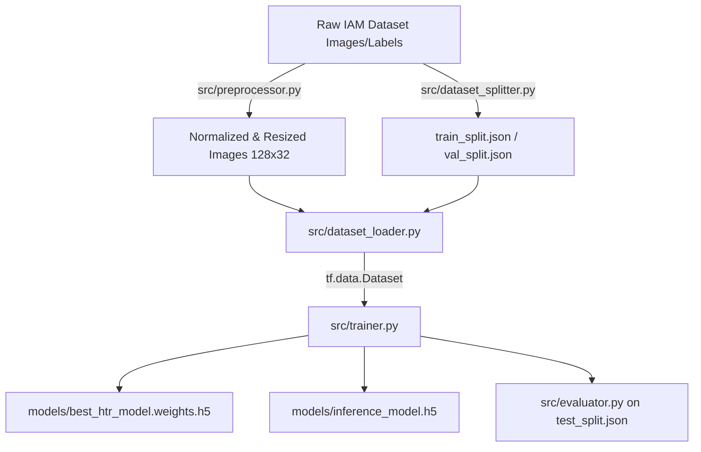

# HTR Training Pipeline Architecture

This document serves as the formal specification for the end-to-end Machine Learning training pipeline for the Handwritten Text Recognition (HTR) system.

## Data Flow Diagram
The pipeline connects the raw datasets, preprocessor, JSON splitters, and TensorFlow Dataset loader into the Model Trainer.

## Component Architecture

### 1. Dataset Loader (`src/dataset_loader.py`)
Responsible for converting disk data into GPU-optimized stream pipelines.
- Reads physical image bytes, decodes PNG/JPG, and scales pixel intensities to `[0, 1]`.
- Implements `tf.keras.layers.StringLookup` to vectorize ground truth text into integer arrays matching the `Config.VOCAB_SIZE`.
- Automatically pads strings to `Config.MAX_TEXT_LENGTH` with `-1`, which is specifically intercepted by our corrected `CTCLayer`.
- Uses `tf.data.AUTOTUNE` to parallelize disk reads, prefetching, and CPU mapping so the GPU is never starved.

### 2. Trainer Orchestrator (`src/trainer.py`)
Responsible for GPU context and epoch tracking.
- Initializes the custom `HTRModel` and extracts the CTC-equipped training model.
- Registers standard callbacks: `TensorBoard`, `EarlyStopping`, `ReduceLROnPlateau`, and `ModelCheckpoint`.
- Specifically saves `best_htr_model.weights.h5` instead of full architecture saves to maintain pure weight fidelity during training.
- Upon finishing the `model.fit()` loop, it strips the CTC loss layer and exports the standalone `inference_model.h5` to prevent Keras layer serialization bugs during production deployment.

### 3. Pipeline Root (`train.py`)
The top-level script that binds the workflow.
1. Generates the runtime `char_map.json` from the DatasetLoader.
2. Bootstraps `train_split.json` and `val_split.json` into datasets.
3. Invokes the ModelTrainer.
4. Executes the automated `HTREvaluator` on `test_split.json` immediately upon training completion to generate the `MODEL_EVALUATION_REPORT.md`.
